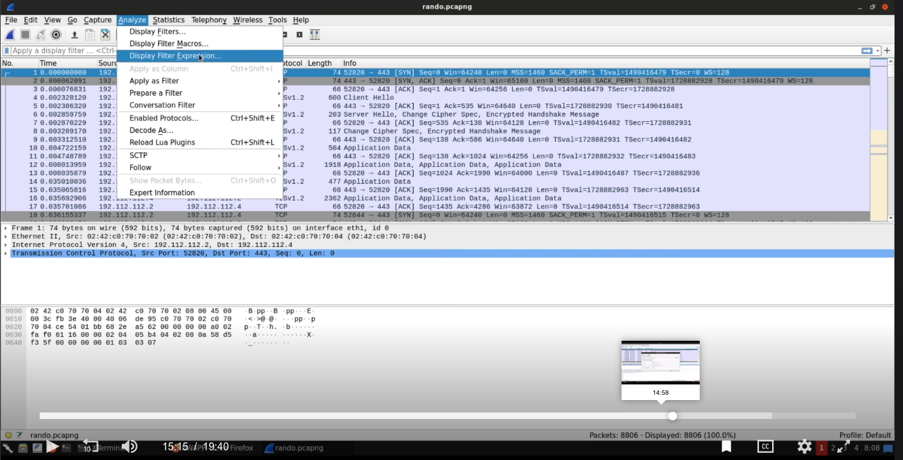
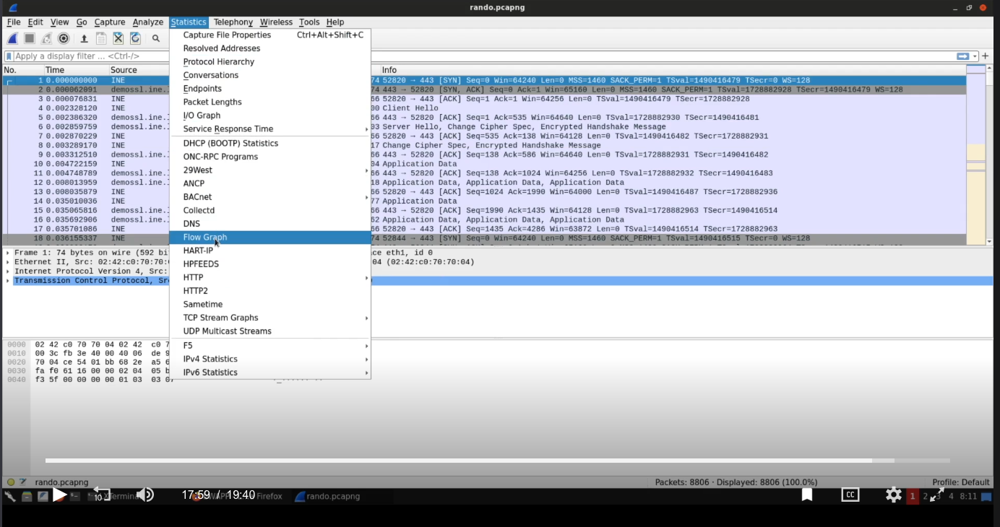

# Network based attacks

Common Network Services
* ARP
* DHCP
* SMB
* FTP
* Telnet
* SSH

## MITM - Man in the Middle Attack

Promiscuous mode - Traffic listening
 Listen to all traffic, sometimes traffic which is not intended for the listener might be viewed

* Demo
    * Ipconfig
        * Nmap <subnet> -sn —> will provide a list of all live hosts on network
        * Nmap list_of_ips -A —> Aggressive scan will reveal more details, but noisy
    * Open Wireshark and listen on the main network interface ex: eth0
        * Can save packet captures - *.pcapng

Wireshark, important features:



Follow a HTTP Stream: A stream is a conversation

Writing filters in Wireshark:

TShark: cmdline based network capture

Basics:

* Good for automation, scripting etc
* Helpful commands
    * tshark -H —> help
    * tshark -D —> display the interfaces available
    * tshark -I eth0 —> listen on interface eth0
    * tshark -r HTTP_traffic.pcap —> open cap file
    * tshark -r HTTP_traffic.pcap -z io,phs -q —> display protocol hierarchy

### TShark Filtering

- tshark -r HTTP_traffic.pcap -Y 'http' --> shows http traffic
    - tshark -r HTTP_traffic.pcap -Y 'http' | more --> output can be piped to text editor of choice
-  tshark -r HTTP_traffic.pcap -Y 'ip.src==192.168.252.128 && ip.dst==52.32.74.91'
- tshark -r HTTP_traffic.pcap -Y 'ip.src==192.168.252.128 && ip.dst==52.32.74.91 && http.request.method==GET'
- tshark -r HTTP_traffic.pcap -Y 'ip.src==192.168.252.128 && ip.dst==52.32.74.91 && http.request.method==GET' -Tfields -e frame.time -e ip.src -e http.request.full_uri --> format output by using Tfields option
- tshark -r HTTP_traffic.pcap -Y 'http contains password' --> simple regex like matching
- tshark -r HTTP_traffic.pcap -Y 'ip contains amazon.in && ip.src==192.168.252.128' -Tfields -e ip.dst -e http.cookie
- [DOES NOT WORK, ERROR unrecognized fields] --> tshark -r HTTP_traffic.pcap -Y 'ip contains amazon.in && ip.src==192.168.252.128' -Tfields -e ip.dst -e http.cookie.session_id -e http.cookie.session_token
- tshark -r HTTP_traffic.pcap -Y 'ip.src==192.168.252.128 && http' -Tfields -e http.user_agent
    - user agent can reveal OS information and browser information

### ARP Poisoning

- ip a s --> find out the ip subnet
- nmap 10.100.13.140/24
    - network discovery reveals Three hosts
- open wireshark and start listening on the correct IP interface
- ping 10.100.13.36 --> generate some traffic to see if you are listening on the correct interface
- ARP poisoning: spoof ARP to tell impersonate other hosts in the network
    - echo 1 > /proc/sys/net/ipv4/ip_forward (Not exactly sure what this is...google this later)
    - arpspoof -i eth1 -t 10.100.13.37 -r 10.100.13.36
        - start spoofing session, the above command tells 10.100.12.37 that our host is 10.100.13.36, so send all the traffic intended for host #36 to me. (The attacker host ip is 10.100.13.140)
    - keep the arpspoof session running in background and switch to wireshark to see if that was a success
    - Wireshark will start seeing traffic meant for host #36
        - view -> Name Resolution -> Resolve network addresses
        - Notice telnet traffic
            - click on the one of the Telnet frame -> rigth click -> follow -> TCP stream
            - The TCP follow reveals login information used for TELNET
                - The Telnet protocol is not secure by nature because it doesn't encrypt packets in transfer, so it is possible to arpspoof and perform MITM attack.

### Wifi Traffic Analysis

Filters:

- What is the name of the Open (No Security) SSID present in the packet dump? 
    -   (wlan.fc.type_subtype== 0x0008) && !(wlan.wfa.ie.wpa.version == 1) && !(wlan.tag.number==48)
        - 0x0008 represents beacon frame
        - filters out wpa 1 and tag number 48 (RSN security packets == WPA 2 packets)
        - The remaining network capture has information on open wifi network with sensitive information, because it is not encrypted
- The SSID 'Home_Network' is operating on which channel? 
    - wlan contains Home_Network
        - Shows all the wlan traffic for Home_Network
        - wirelan LAN -> Tagged Parameter -> OS parameter set -> channel in use
- Which security mechanism is configured for SSID 'LazyArtists'? Your options are: OPEN, WPA-PSK, WPA2-PSK.
    - wlan contains LazyArtists
        - Shows traffic with LazyArtists SSID
        - wireless LAN -> Tagged Parameter -> RSN Information -> If AES and PSK are seen, then the wlan is secured by WPA2
- Is WiFi Protected Setup (WPS) enabled on SSID 'Amazon Wood'? State Yes or No.
    - (wlan.ssid contains Amazon) && (wlan.fc.type_subtype == 0x0008)
        - 0x0008 refers to beacon frames, which usually has the WLAN data
        - wireless LAN -> Tagged Parameter -> Vendor Specific: Microsoft Corp.: WPS
    - The answer is yes
- What is the total count of packets which were either transmitted or received by the device with MAC e8:de:27:16:87:18? 
    - (wlan.ta == e8:de:27:16:87:18) || (wlan.ra == e8:de:27:16:87:18)
        - wlan.ta is for transmitted and wlan.ra is for recieved
    - wireshark display total packets in bottom status bar
- What is the MAC address of the station which exchanged data packets with SSID 'SecurityTube_Open'?
    - find out mac address for SSID with SecurityTube
        - wlan contains SecurityTube
        - beacon frame -> Transmitter Address
    - (wlan.bssid == e8:de:27:16:87:18) && (wlan.fc.type_subtype == 0x0020)
        - Navigate to a TCP packet
            - Data flags -> Destination Address has the mac address
- From the last question, we know that a station was connected to SSID 'SecurityTube_Open'. Provide TSF timestamp of the association response sent from the access point to this station.
    - (wlan.bssid == e8:de:27:16:87:18) && (wlan.addr == 5c.51.88.31.a0.3b) && (wlan.fc.type_subtype == 0x0001)
        - 0x0001 has the Association Response flag
        - 802.11 radio information -> TSF Timestamp

### Filtering Advanced: Wifi

Tshark filters:

- Which command can be used to show only WiFi traffic
    - tshark -r WiFi_traffic.pcap -Y 'wlan'
- Which command can be used only view the deauthentication packets?
    - tshark -r WiFi_traffic.pcap -Y 'wlan.fc.type_subtype == 0x000c'
        - 0x000c refers to deauthentication packets
- Which command can be used to only display WPA handshake packets?
    - tshark -r WiFi_traffic.pcap -Y 'eapol'
- Which command can be used to only print the SSID and BSSID values for all beacon frames?
    - tshark -r WiFi_traffic.pcap -Y 'wlan.fc.type_subtype==8' -Tfields -e wlan.ssid -e wlan.bssid
        - basically prints ssid and mac address
- What is BSSID of SSID “LazyArtists”?
    - tshark -r WiFi_traffic.pcap -Y 'wlan.ssid ==LazyArtists' -Tfields -e wlan.bssid
- SSID “Home_Network” is operating on which channel?
    - tshark -r WiFi_traffic.pcap -Y 'wlan.ssid == Home_Network' -Tfields -e wlan_radio.channel
- Which two devices received the deauth messages? State the MAC addresses of both.
    - tshark -r WiFi_traffic.pcap -Y 'wlan.fc.type_subtype == 0x000c' -Tfields -e wlan.bssid
    or
    - tshark -r WiFi_traffic.pcap -Y 'wlan.fc.type_subtype == 0x000c' -Tfields -e wlan.ra
- Which device does MAC 5c:51:88:31:a0:3b belongs to? Mention manufacturer and model number of the device.
    - tshark -r WiFi_traffic.pcap -Y 'wlan.ta==5c:51:88:31:a0:3b && http' -Tfields -e http.user_agent
